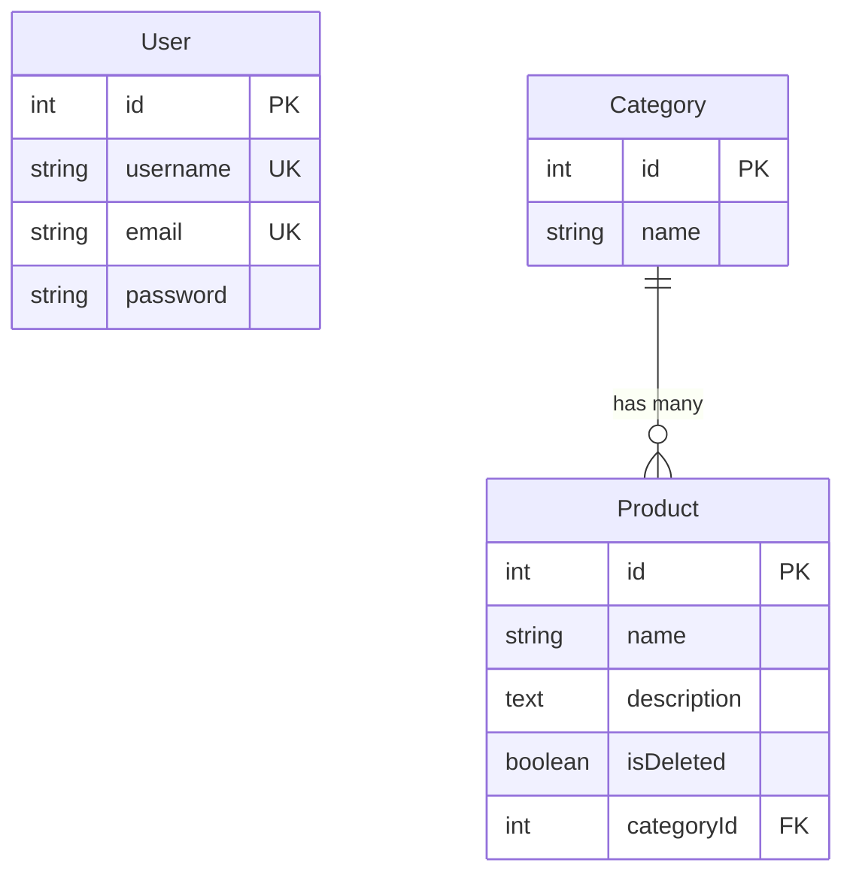

# Bionic Test API

A production-style REST API built with **Express**, **Sequelize**, and **MySQL**. It demonstrates common backend patterns—modular routing, JWT authentication, ORM modeling, and integration testing—in a small but complete codebase suitable for learning and reference.

The API manages **users** (authentication), **categories**, and **products**. All category and product endpoints require a valid JWT. Products use soft deletion (`isDeleted`) and belong to exactly one category.

---

## Entity Relationship Diagram



> **Note:** `User` is independent of the catalog domain. Authentication is token-based; users do not own categories or products in the data model.

---

## Core Learning Points

### 1. Express Routing

Request handling is split across three layers: the app entry point, a central router, and controller functions.

| Layer | File | Responsibility |
|-------|------|----------------|
| App bootstrap | `src/app.js` | Creates the Express instance, registers JSON body parsing, mounts routes |
| Route definitions | `src/routes/index.js` | Maps HTTP methods and paths to controller handlers and middleware |
| Controllers | `src/controllers/*.js` | Business logic, validation, database calls, and response formatting |

**Request flow:**

```
HTTP Request
  → express.json()          (parse JSON body)
  → router                  (match path + method)
  → authenticate middleware (protected routes only)
  → controller handler      (async logic)
  → JSON / 204 response
```

Public routes (`GET /`, `GET /health`, `POST /api/auth/*`) skip authentication. All `/api/categories` and `/api/products` routes pass through the `authenticate` middleware before reaching their controllers.

> **Takeaway:** Keeping routes thin and delegating logic to controllers makes the API easy to test (Supertest hits the same `app` export) and easy to extend (add a route + controller without touching server startup).

---

### 2. Token-Based Authentication

Authentication uses **JSON Web Tokens** via the `jsonwebtoken` package.

**Issuing tokens** — `src/controllers/authController.js`

On successful login, the server signs a payload `{ id, username, email }` with `JWT_SECRET` and an expiration of **`2h`** (configured via `JWT_EXPIRES_IN` in `.env`):

```javascript
const token = jwt.sign(
  { id: user.id, username: user.username, email: user.email },
  process.env.JWT_SECRET,
  { expiresIn: process.env.JWT_EXPIRES_IN || '2h' }
);
```

**Validating tokens** — `src/middleware/auth.js`

Protected routes expect an `Authorization` header in the form `Bearer <token>`. The middleware:

1. Rejects requests with a missing or malformed header (`401 Authentication required`)
2. Verifies the token signature and expiration with `jwt.verify()`
3. Attaches the decoded payload to `req.user` and calls `next()`
4. Returns `401 Invalid or expired token` on verification failure

**Password security** — `src/models/User.js`

Passwords are hashed with `bcryptjs` in Sequelize `beforeCreate` / `beforeUpdate` hooks. Plain-text passwords never persist to the database. Login compares credentials via `User.prototype.validatePassword()`.

> **Takeaway:** Stateless JWT auth scales well for APIs—no server-side session store—but tokens must be kept secret on the client and `JWT_SECRET` must be strong in production.

---

### 3. Sequelize Database Connection

Database configuration lives in `src/config/database.js`. A single `Sequelize` instance is created with the `mysql2` dialect and environment-driven credentials:

```javascript
const sequelize = new Sequelize(
  process.env.DB_NAME || 'bionic_test',
  process.env.DB_USER || 'root',
  process.env.DB_PASSWORD || '',
  {
    host: process.env.DB_HOST || 'localhost',
    port: process.env.DB_PORT || 3306,
    dialect: 'mysql',
    logging: process.env.NODE_ENV === 'test' ? false : console.log,
  }
);
```

**Connection lifecycle** — `src/server.js`

| Step | Method | Purpose |
|------|--------|---------|
| Startup | `sequelize.authenticate()` | Verifies credentials and opens the connection pool |
| Schema sync | `sequelize.sync()` | Creates/updates tables to match model definitions |
| Serve | `app.listen()` | Starts accepting HTTP requests |
| Shutdown (tests) | `sequelize.close()` | Drains the pool and releases connections |

Sequelize maintains an internal **connection pool** (default pool size via `mysql2`). Requests borrow connections from the pool for queries and return them when done—no manual connection management is required in controllers.

> **Takeaway:** Centralizing the Sequelize instance in `src/config/database.js` and exporting it through `src/models/index.js` gives every model and controller a shared, pooled connection.

---

### 4. Model Definitions & Associations

Models are defined with `sequelize.define()` and wired together in `src/models/index.js`.

**User** (`src/models/User.js`)

| Field | Constraints |
|-------|-------------|
| `username` | Required, unique |
| `email` | Required, unique, validated as email |
| `password` | Required, hashed before save |

**Category** (`src/models/Category.js`)

| Field | Constraints |
|-------|-------------|
| `name` | Required |

**Product** (`src/models/Product.js`)

| Field | Constraints |
|-------|-------------|
| `name` | Required, 3–200 characters (`validate.len`) |
| `description` | Optional text |
| `isDeleted` | Boolean, defaults to `false` (soft delete flag) |
| `categoryId` | Required foreign key → `categories.id` |

**1:N association** — `src/models/index.js`

```javascript
Category.hasMany(Product, { foreignKey: 'categoryId', as: 'products' });
Product.belongsTo(Category, { foreignKey: 'categoryId', as: 'category' });
```

Product controllers use `include: [{ model: Category, as: 'category' }]` to eager-load the parent category. Category deletion is blocked when non-deleted products still reference it (`categoryController.js`).

> **Takeaway:** Declarative model validation (e.g., product name length) catches bad input at the ORM layer; associations encode relational integrity in code and enable convenient eager loading.

---

### 5. Integration Testing with Supertest

Tests live in `tests/api.test.js` and exercise the full HTTP stack against a real MySQL database.

**Setup** — `tests/setup.js` + `jest.config.js`

- `NODE_ENV` is set to `test` (disables SQL logging)
- `JWT_SECRET` falls back to `test-jwt-secret` if unset
- Jest runs with `--runInBand` (serial execution avoids DB race conditions) and `--forceExit` (clean shutdown after async work)

**Test lifecycle** — `tests/api.test.js`

```javascript
beforeAll(async () => {
  await sequelize.authenticate();
  await sequelize.sync({ force: true });   // drop & recreate tables
  await User.create({ /* seed user */ });
  // login to obtain authToken for protected routes
});

afterAll(async () => {
  await sequelize.close();
});
```

**What is tested**

| Area | Examples |
|------|----------|
| Public routes | `GET /`, `GET /health` |
| Auth gate | Unauthenticated `GET /api/products` → `401` |
| Categories CRUD | Create, list, read by ID, update |
| Products CRUD | Create, list, read, update, soft delete |
| Soft delete | Deleted product returns `404` on subsequent GET |
| Category delete | Hard delete succeeds when no products are linked |

Supertest sends real HTTP requests to the exported Express `app` (`src/app.js`) without starting a separate server process—controllers, middleware, and Sequelize all run as they would in production.

> **Takeaway:** Integration tests validate the entire request path. Seeding data in `beforeAll` and using a shared `authToken` keeps tests realistic while avoiding repeated login overhead.

---

## Tech Stack & Dependencies

| Technology | Version | Role |
|------------|---------|------|
| Node.js | 18+ recommended | Runtime (`dev` script uses `--watch`, available in Node 18+) |
| Express | ^4.21.0 | HTTP server and routing |
| Sequelize | ^6.37.3 | ORM for MySQL |
| mysql2 | ^3.11.0 | MySQL driver (connection pooling) |
| jsonwebtoken | ^9.0.2 | JWT signing and verification |
| bcryptjs | ^2.4.3 | Password hashing |
| dotenv | ^16.4.5 | Environment variable loading |
| Jest | ^29.7.0 | Test runner |
| Supertest | ^7.0.0 | HTTP assertion library |

---

## Project Architecture

```
bionic-test/
├── .env.example              # Environment variable template
├── jest.config.js            # Jest configuration (test match, setup file)
├── package.json              # Scripts and dependencies
├── src/
│   ├── app.js                # Express app (middleware + routes), exported for tests
│   ├── server.js             # Entry point: DB connect, sync, listen
│   ├── config/
│   │   └── database.js       # Sequelize instance and MySQL connection config
│   ├── controllers/
│   │   ├── authController.js     # register, login (JWT issuance)
│   │   ├── categoryController.js # Category CRUD
│   │   └── productController.js  # Product CRUD (soft delete)
│   ├── middleware/
│   │   └── auth.js           # JWT verification middleware
│   ├── models/
│   │   ├── index.js          # Model registry and associations
│   │   ├── User.js           # User schema + password hooks
│   │   ├── Category.js       # Category schema
│   │   └── Product.js        # Product schema + validation
│   └── routes/
│       └── index.js          # Route table (paths → middleware → controllers)
└── tests/
    ├── setup.js              # Test env overrides (NODE_ENV, JWT_SECRET)
    └── api.test.js           # Integration tests (Supertest + Jest)
```

---

## Getting Started

### Prerequisites

- **Node.js** 18 or later
- **MySQL** 8.x (or compatible) running locally or remotely
- A MySQL user with permission to create databases and tables

### 1. Clone and install dependencies

```bash
git clone <repository-url>
cd bionic-test
npm install
```

### 2. Configure environment variables

Copy the example file and edit values for your environment:

```bash
cp .env.example .env
```

`.env.example` contents (match these keys exactly):

```env
PORT=3000
NODE_ENV=development

DB_HOST=localhost
DB_PORT=3306
DB_NAME=bionic_test
DB_USER=root
DB_PASSWORD=

JWT_SECRET=your-secret-key-change-in-production
JWT_EXPIRES_IN=2h
```

| Variable | Description |
|----------|-------------|
| `PORT` | HTTP port (default `3000`) |
| `NODE_ENV` | `development` or `test` |
| `DB_HOST` | MySQL host |
| `DB_PORT` | MySQL port |
| `DB_NAME` | Database name (created automatically on first sync if permissions allow) |
| `DB_USER` | MySQL username |
| `DB_PASSWORD` | MySQL password (empty for local root with no password) |
| `JWT_SECRET` | Secret key for signing JWTs—**change in production** |
| `JWT_EXPIRES_IN` | Token lifetime (default `2h`) |

### 3. Create the database (if needed)

```bash
mysql -u root -p -e "CREATE DATABASE IF NOT EXISTS bionic_test;"
```

Sequelize `sync()` on startup will create tables from model definitions.

### 4. Start the server

```bash
# Production-style start
npm start

# Development with auto-restart on file changes
npm run dev
```

On success you should see:

```
Database connection established.
Server running on port 3000
```

Verify with:

```bash
curl http://localhost:3000/health
```

### 5. Authenticate and call protected routes

```bash
# Register a user
curl -X POST http://localhost:3000/api/auth/register \
  -H "Content-Type: application/json" \
  -d '{"username":"demo","email":"demo@example.com","password":"secret123"}'

# Login and capture the token
curl -X POST http://localhost:3000/api/auth/login \
  -H "Content-Type: application/json" \
  -d '{"email":"demo@example.com","password":"secret123"}'

# Use the token (replace <token> with the value from login response)
curl http://localhost:3000/api/categories \
  -H "Authorization: Bearer <token>"
```

---

## API Reference

All protected routes require the header: `Authorization: Bearer <token>`

### Public

| Method | Route | Auth | Description |
|--------|-------|------|-------------|
| `GET` | `/` | No | Welcome message |
| `GET` | `/health` | No | Health check |
| `POST` | `/api/auth/register` | No | Create a new user |
| `POST` | `/api/auth/login` | No | Authenticate and receive JWT |

**Register** — `POST /api/auth/register`

```json
{ "username": "string", "email": "string", "password": "string" }
```

Response `201`: `{ "id", "username", "email" }`

**Login** — `POST /api/auth/login`

```json
{ "email": "string", "password": "string" }
```

Response `200`: `{ "token": "eyJ..." }`

---

### Categories (authenticated)

| Method | Route | Description |
|--------|-------|-------------|
| `GET` | `/api/categories` | List all categories |
| `GET` | `/api/categories/:id` | Get category by ID |
| `POST` | `/api/categories` | Create category |
| `PUT` | `/api/categories/:id` | Update category |
| `DELETE` | `/api/categories/:id` | Delete category (blocked if products exist) |

**Create / Update body**

```json
{ "name": "string" }
```

---

### Products (authenticated)

| Method | Route | Description |
|--------|-------|-------------|
| `GET` | `/api/products` | List non-deleted products (includes category) |
| `GET` | `/api/products/:id` | Get product by ID |
| `POST` | `/api/products` | Create product |
| `PUT` | `/api/products/:id` | Update product |
| `DELETE` | `/api/products/:id` | Soft delete (`isDeleted = true`) |

**Create body**

```json
{
  "name": "string (3–200 chars)",
  "description": "string (optional)",
  "categoryId": 1
}
```

**Update body** (all fields optional)

```json
{
  "name": "string",
  "description": "string",
  "categoryId": 1
}
```

---

### Common error responses

| Status | Meaning |
|--------|---------|
| `400` | Validation error or business rule violation |
| `401` | Missing, invalid, or expired token |
| `404` | Resource not found |
| `409` | Duplicate username or email on register |
| `500` | Server error |

---

## Running Tests

Ensure MySQL is running and `.env` (or test defaults) points to an accessible database. Tests use `sync({ force: true })`, which **drops and recreates all tables**—use a dedicated test database in shared environments.

```bash
npm test
```

This runs:

```bash
jest --runInBand --forceExit
```

| Flag | Purpose |
|------|---------|
| `--runInBand` | Run tests serially to avoid concurrent DB conflicts |
| `--forceExit` | Exit after tests complete (handles open Sequelize connections) |

**Test coverage areas:** public routes, authentication enforcement, full category CRUD, product CRUD with soft delete verification, and category hard delete.

To add coverage reporting, extend `jest.config.js` with a `collectCoverageFrom` pattern and run `jest --coverage`.

---

## License

ISC
